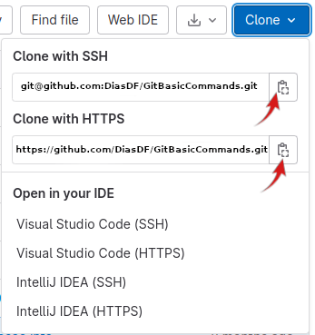
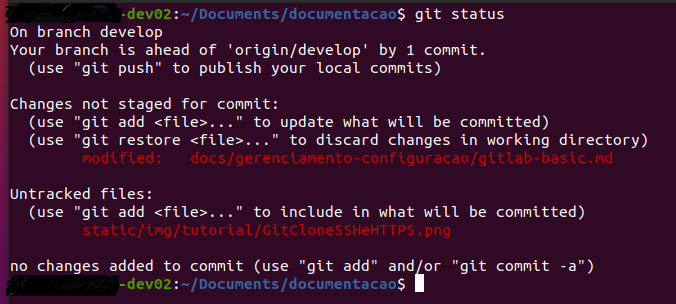
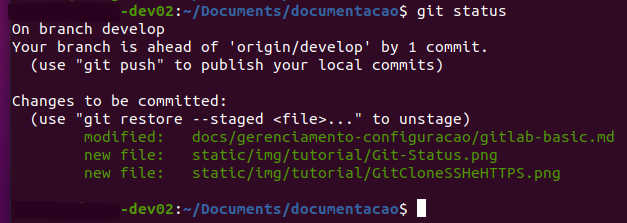
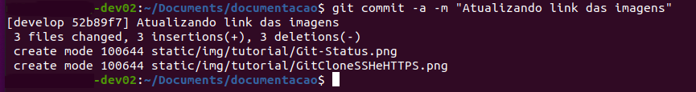

<!-- @format -->

## Guia dos principais comandos de git

Para inicializar um novo repositório

```js title="Git Init"
 git init
```

Para Clonar um repositório

```js title="Git Clone"
 git clone ssh://git@linkCaminho:porta/usuario/nome-do-arquivo.git
 git clone https://linkCaminho/usuario/nome-do-arquivo.git
```

Verifica se alguma mudança foi feita no branch atual

```js title="Git Status"
 git status
```

Adiciona arquivos ao versionamento

```js title="Git Add"
 git add <arquivo>
```

Salva as alterações de código

```js title="Git Commit"
 git commit
```

Volta o código a algum ponto específico

```js title="Git Reset"
 git reset
```

Descarta mudanças em algum arquivo específico

```js title="Git Checkout"
 git checkout <arquivo>
```

Listagem de branches

```js title="Git Branch"
 git branch
```

Altera o branch

```js title="Git Checkout"
 git checkout <branch>
```

Recebe atualizações do repo remoto

```js title="Git Pull"
 git pull
```

Envia atualizações para o repo remoto

```js title="Git Push"
 git push
```

Recebe branches remotos que não estão mapeados

```js title="Git Fetch"
 git fetch
```

Visualize o histórico de commits

```js title="Git Log"
 git log
```

Histórico Resumido de commits

```js title="Git Log"
 git log --oneline
```

# Clonando o repositório

## Copiando o URL do repositório remoto

Nesse exemplo vc terá duas opções SSH e HTTPS (git)



Copie o URL do repositório a ser clonado e (Na pasta raiz onde ficará o clone) execute no terminal como o comando git clone

```js title="Git Clone"
git clone ssh://git@linkCaminho:2020/usuario/nome-do-arquivo.git
```

## Visualizar e conferir o clone

Vá até o novo diretório clonado: $ cd (nomeDoNovoRepositório);
Liste os novos arquivos: $ ls

```js title="CD e LS comandos"
cd documentacao
ls
```

Visualize o histórico de commits com o seguinte comando: $ Git Log
Sai digitando "Q"

```js title="Git Log"
git log
```

## VSCode (Visual Studio Code)

### Visualizando o repositório clonado no editor Visual Studio Code

```js title="Code . (ponto)"
code .
```

# ATUALIZAÇÕES DO REPOSITÓRIO

## Para atualizar o repositório GitLab com as alterações feitas no diretório local

Listando e comparando se existem NOVAS alterações a serem incluídas no Repositório: $ git status.

```js title="Git Status"
git status
```



Nesta imagem em vermelho são mostrados todos os arquivos e diretórios do Repositório GitLab (nuvem) Versus Repositório Local.
São listados os arquivos do diretório LOCAL que sofreram alterações comparando-os com os arquivos do GITLAB.

## GIT ADD para Adicionar as alterações

Adicionando todas as novas atualizações ao Repositório GitLab: $ git add . (ponto) ou (nomeDoArquivo);

```js title="Git Add"
git add .
```

OBS: Aparentemente nada mudou... verique as alterações com o comando: $ git status

Verifique todos os arquivos que serão carregados no repositório

```js title="Git Status"
git status
```



## GIT COMMIT

Commit (Fazendo upload) das novas alterações para o Repositório: git commit -a -m "texto"
(-a all files, todos os tipos de arquivos, -m relatar em uma mensagem as alterações que foram feitas neste commit)

```js title="Git Commit"
git commit -a -m "Atualizando os Repositórios GitLab e Infraestrutura de Sistemas."
```



## GIT PULL

Para ATUALIZAR imediatamente o repositório local e BAIXAR o conteúdo de um repositório remoto

```js title="Git Pull"
git pull
```

## Para Excluir arquivos de um COMMIT

Utilize o comando "Git Ignore (nomeDoArquivo)" para excluir arquivos da lista (Git Status) a ser comitada.

```js title="Git Ignore"
git ignore imagem.png
```

## CRIAR O LINK DE UM REPOSITÓRIO LOCAL PARA O GITLAB

### GIT REMOTE ADD ORIGIN (URL https://...)

A URL deve ser a do GitLab onde deverá ficar seu repositório

Se você tem um diretório local que AINDA NÃO POSSUI uma extenção no GITLAB use os comandos abaixo.
OBS: UMA LINHA DE COMANDO POR VEZ

MUDAR O ORIGIN??? NÃO SEI
git remote set-url origin https://linkCaminho/usuario/nome-do-arquivo.git

```js title="Git Remote Add Origin"
git remote add origin https://linkCaminho/usuario/nome-do-arquivo
git branch -M master
git push -u origin master
```

A linha "git branch -M master" informa a branch principal que neste exemplo é a "master".
Dependendo do seu projeto a BRANCH pode ser outra.

A linha "git push -u origin master" faz o upload de todos o arquivos LOCAIS para GITLAB

Use "GIT BRANCH" para visualizar em qual branch vc está.

Com uma opção -m ou -M, (oldbranch) será renomeado para (newbranch).
Se (oldbranch) tiver um reflog correspondente, ele será renomeado para corresponder a (newbranch) e uma entrada de reflog será criada para lembrar a renomeação do branch.
Se (newbranch) existir, -M deve ser usado para forçar a renomeação.

Com uma opção -d ou -D, (branchname) será excluído.
Você pode especificar mais de uma ramificação para exclusão.
Se a ramificação atualmente tiver um reflog, o reflog também será excluído.

Use -r junto com -d para excluir ramificações de rastreamento remoto. Observe que só faz sentido excluir branches de rastreamento remoto se eles não existirem mais no repositório remoto ou se git fetch foi configurado para não buscá-los novamente. Consulte também o subcomando prune de git-remote para obter uma maneira de limpar todas as ramificações de rastreamento remoto obsoletas.

```js title="Git branch"
git branch
```

Continua no vídeo youtube aos 13:50

Você pode remover uma origem

```js title="Remove Origin"
git remote remove origin
```

adicionar um novo com o novo endereço

```js title="Add Origin"
git remote add origin git://suaUrl
```

Alterar o diretório remoto

```js title="Set-URL"
git remote set-url origin git://suaUrl
```

Ou pode renomeá-lo o atual e adicionar um novo.

```js title="Rename Origin"
git remote rename origin old-origin
```

## Bibliografia

APRENDA GIT EM 30 MIN. - OS PRINCIPAIS COMANDOS DE GIT By Matheus Battisti - Hora de Codar
<https://youtu.be/Zwv9qRyVeU4>

Clonando um repositório com Git e GitHub - LUZDALIS LOPEZ D´ROMERO
<https://www.alura.com.br/artigos/clonando-repositorio-git-github?gclid=Cj0KCQjwmZejBhC_ARIsAGhCqne6O4zwZQN_rybsLumzAY4Z-WdRYVS4wUeyBmN4D2LExWE_b_46ko0aAjAtEALw_wcB>
