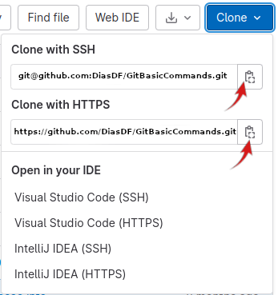
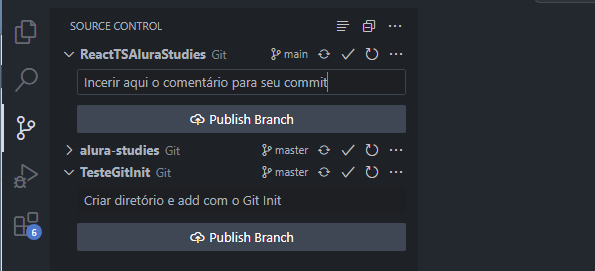
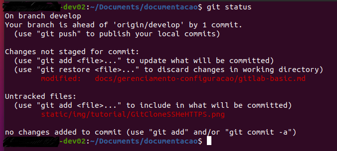
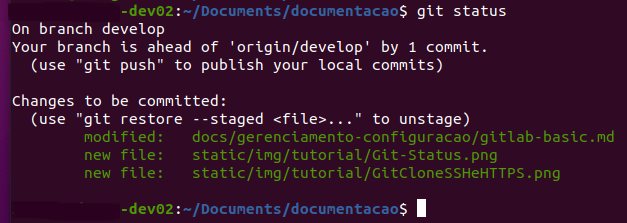
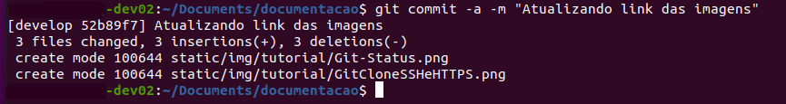

<!-- @format -->
---
# Guia dos principais comandos de git

### Entendendo Resumidamente o Processo, Considerações

Depois, o "git remote add origin" é o comando que vincula o seu repositório local a um repositório remoto, definindo a origem para onde você vai enviar suas mudanças.


**EM RESUMO:** 
A finalidade de criar repositórios:  
Um **Repositório** é como se fosse um "armário digital" onde o projeto fica guardado, com todo o histórico de alterações. Nele é possível OBTER e principalmente OFERECER contribuições ao projeto com **segurança e controle** rigoroso das versões, das etapas de implementações e dos colaboradores individualmente.  
Dessa forma o projeto evolui gradualmente em cada equipe de desenvolvimento de modo **coordenado** no servidor - por exemplo o github.  
**Git** - É o sistema que roda no seu computador, permitindo que você rastreie, gerencie e versiona o código.  
**Gitbub** - É um "Servidor Remoto" em núvem entre outros como Gitlab, Bitbucket para compartilhamento de projetos online. É possível também criar uma Rede Local com um servidor privado para o repositório master/central como nos serviços: Gitea, GitLab Community Edition, Gogs etc.  

### "Algumas" Etapas do Processo:  
**Criar os Repositórios:** Locais, nas máquinas locais (Git init) e Repositórios Remotos: Servidor núvem (Github), Servidor em Rede e máquinas locais de outros usuários.  
**Git init** - É o comando de terminal que inicializa um "Repositório Local" para projetos em seu computador. Com o Git seu projeto local poderá iniciar do zero ou a partir de uma cópia ou parte de um projeto e principalmente total controle de alterações e versionamentos, que é o objetivo principal.  
**Git Remote add origin** - É o comando que vincula o seu "Repositório Local" a um "Repositório Remoto".  
**Git Fork** - cria uma cópia "independente" de um projeto ou parte dele do repositório de outro usuário que está no servidor (como o GitHub) para seu Repositório Remoto (Servidor). No fork você terá controle total dá cópia do projeto pois o original só será alterado com a permissão do proprietário. Isso permite que sejam feitas adaptações, testes, correções, inovações entre outras coisas em um projeto sem danificar o orginal.  
Posteriormente, Abre-se um **Pull Request** do seu fork para o repositório original contendo suas propostas de alterações ou revisões.  
**Git Clone** - capta projetos Remotos para sua máquina local.  
**Git Add** - Adiciona **Versões de Alterações** ao projeto local.  
**Git Commit** - Descreve e lista o que foi alterado.  
**Git push** - Envia suas alterações para o seu Diretório Remoto.  
**Git pull** - Recebe todas as atualizações para seu projeto.  
**Git Merge** - Agrega as alterações dos usuários ao Projeto Principal que posteriormente receberá o estatus de Projeto em Produção (Termo Técnico para utilização pelo usuário final), Projeto em Desenvolvimento (É o projeto que ainda está passível de receber novas implementações, alterações, testes etc.).  

### 
### Para inicializar um novo repositório
 
```command title="Git Init"
 git init
```
 
### Para Clonar um repositório
 
```js title="Git Clone"
 git clone ssh://git@linkCaminho:porta/usuario/nome-do-arquivo.git
 git clone https://linkCaminho/usuario/nome-do-arquivo.git
```

### Git Fork
Um fork cria uma cópia "independente" de um repositório de outro usuário dentro do próprio servidor (como o GitHub) para seu projeto ou novo projeto. O Clone capta projetos de uma máquina local. No fork você terá total controle do projeto pois é apenas uma cópia do original que só será alterado com a permissão do proprietário. Isso permite que sejam feitas adaptações, testes, correções, inovações entre outras coisas em um projeto sem danificar o orginal. 
Posteriormente, Abre-se um Pull Request do seu fork para o repositório original contendo suas propostas de alterações.


### Verifica se alguma mudança foi feita no branch atual
 
```js title="Git Status"
 git status
```
 
### Adiciona arquivos ao versionamento
 
```js title="Git Add"
 git add <arquivo>
```
 
### Salva as alterações de código

```js title="Git Commit"
 git commit -m "Coments"
```

### Volta o código a algum ponto específico

```js title="Git Reset"
 git reset
```

### Descarta mudanças em algum arquivo específico

```js title="Git Checkout"
 git checkout <arquivo>
```

### Listagem de branches

```js title="Git Branch"
 git branch
```

### Altera o branch

```js title="Git Checkout"
 git checkout <branch>
```

### Recebe atualizações do repo remoto

```js title="Git Pull"
 git pull
```

### Envia atualizações para o repo remoto

```js title="Git Push"
 git push
```

### Recebe branches remotos que não estão mapeados

```js title="Git Fetch"
 git fetch
```
 
### Visualize o histórico de commits

```js title="Git Log"
 git log
```

### Histórico Resumido de commits

```js title="Git Log"
 git log --oneline
```
---
# Criando um repositório no DIRETÓRIO LOCAL
### GIT INIT
1) Cria um repositório no DIRETÓRIO LOCAL que posteriormente pode ser adicionado ao Github pelo comando GIT REMOTE ADD ORIGIN ....

```js title="Git Init"
git init
```
2) Poderá cria-lo no GitHub (Nuvem) e posteriormente usar o GIT CLONE HTTPS:// na RAIZ DIRETÓRIO LOCAL onde deseja que seja craido o repositório.




3) Estando o Github e VsCode SINCRONIZADOS, basta ir no ícone do Git e acessar a opção  "CRIAR DIRETÓRIO E ADD COM O GIT INIT"




# Clonando o repositório

### Copiando o URL do repositório remoto

Nesse exemplo vc terá duas opções SSH e HTTPS (git)


Copie o URL do repositório a ser clonado e (Na pasta raiz onde ficará o clone) execute no terminal como o comando git clone

```js title="Git Clone"
git clone ssh://git@linkCaminho:2020/usuario/nome-do-arquivo.git
```

### Visualizar e conferir o clone

Vá até o novo diretório clonado: $ cd (nomeDoNovoRepositório);
Liste os novos arquivos: $ ls

```js title="CD e LS comandos"
cd documentacao
ls
```

Visualize o histórico de commits com o seguinte comando: $ Git Log
Sai digitando "Q"

```js title="Git Log"
git log
```

## VSCode (Visual Studio Code)

### Visualizando o repositório clonado no editor Visual Studio Code

```js title="Code . (ponto)"
code .
```

# ATUALIZAÇÕES DO REPOSITÓRIO
### Para atualizar o repositório GitLab com as alterações feitas no diretório local

Listando e comparando se existem NOVAS alterações a serem incluídas no Repositório: $ git status.

```js title="Git Status"
git status
```



Nesta imagem em vermelho são mostrados todos os arquivos e diretórios do Repositório GitLab (nuvem) Versus Repositório Local.
São listados os arquivos do diretório LOCAL que sofreram alterações comparando-os com os arquivos do GITLAB.

### GIT ADD para Adicionar as alterações

Adicionando todas as novas atualizações ao Repositório GitLab: $ git add . (ponto) ou (nomeDoArquivo);

```js title="Git Add"
git add .
```

OBS: Aparentemente nada mudou... verique as alterações com o comando: $ git status

Verifique todos os arquivos que serão carregados no repositório

```js title="Git Status"
git status
```



### GIT COMMIT

Commit (Fazendo upload) das novas alterações para o Repositório: git commit -a -m "texto"
(-a all files, todos os tipos de arquivos, -m relatar em uma mensagem as alterações que foram feitas neste commit)

```js title="Git Commit"
git commit -a -m "Atualizando os Repositórios GitLab e Infraestrutura de Sistemas."
```



### GIT PULL

Para ATUALIZAR imediatamente o repositório local e BAIXAR o conteúdo de um repositório remoto

```js title="Git Pull"
git pull
```

## Para Excluir arquivos de um COMMIT

Utilize o comando "Git Ignore (nomeDoArquivo)" para excluir arquivos da lista (Git Status) a ser comitada.

```js title="Git Ignore"
git ignore imagem.png
```

## CRIAR O LINK DE UM REPOSITÓRIO LOCAL PARA O GITLAB

### GIT REMOTE ADD ORIGIN (URL https://...)

A URL deve ser a do GitLab onde deverá ficar seu repositório

Se você tem um diretório local que AINDA NÃO POSSUI uma extenção no GITLAB use os comandos abaixo.
OBS: UMA LINHA DE COMANDO POR VEZ

### MUDAR O ORIGIN??? OU ADICIONAR UMA ORIGEM
git remote set-url origin https://linkCaminho/usuario/nome-do-arquivo.git

```js title="Git Remote Add Origin"
git init
git remote add origin https://linkCaminho/usuario/nome-do-arquivo
git branch -M master
git push -u origin master
```

A linha "git branch -M master" informa a branch principal que neste exemplo é a "master".
Dependendo do seu projeto a BRANCH pode ser outra.

A linha "git push -u origin master" faz o upload de todos o arquivos LOCAIS para GITLAB

Use "GIT BRANCH" para visualizar em qual branch vc está.

Com uma opção -m ou -M, (oldbranch) será renomeado para (newbranch).
Se (oldbranch) tiver um reflog correspondente, ele será renomeado para corresponder a (newbranch) e uma entrada de reflog será criada para lembrar a renomeação do branch.
Se (newbranch) existir, -M deve ser usado para forçar a renomeação.

Com uma opção -d ou -D, (branchname) será excluído.
Você pode especificar mais de uma ramificação para exclusão.
Se a ramificação atualmente tiver um reflog, o reflog também será excluído.

Use -r junto com -d para excluir ramificações de rastreamento remoto. Observe que só faz sentido excluir branches de rastreamento remoto se eles não existirem mais no repositório remoto ou se git fetch foi configurado para não buscá-los novamente. Consulte também o subcomando prune de git-remote para obter uma maneira de limpar todas as ramificações de rastreamento remoto obsoletas.

```js title="Git branch"
git branch
```

Continua no vídeo youtube aos 13:50

### Você pode remover uma origem

```js title="Remove Origin"
git remote remove origin
```

### Adicionar um novo Repositório Remoto e um novo endereço

```js title="Add Origin"
git remote add origin git://suaUrl
```

### Alterar o diretório remoto

```js title="Set-URL"
git remote set-url origin git://suaUrl
```

### Renomear o atual

```js title="Rename Origin"
git remote rename origin old-origin
```

### Terminal MacOs / Windows:
**OBS use o botão "command" no lugar de "ctrl"**

"dir" ou "ls" - Listagem de arquivos.

"Tab" - completa nomes de comandos.

“ctrl+L” - Limpa a Tela do Terminal.

"command+l" - Desfaz o último comando.

"cd .." - Para sair da pasta.

"cd ." - Para entrar na pasta.

"mkdir" - Criar uma pasta.

"echo" - Criar um arquivo dentro da pasta.

Ex. C:\Users\gianc\Pasta_exemplo> echo "olá" > arquivo.txt

"cat" - Para ver o conteúdo dentro do arquivo.

"rm -r" - Para deletar tanto o arquivo quanto a pasta.

CRIAR A PASTA GIT NA RAIZ HOME “cd ~ “ “mkdir gitpython”

“pwd “ Ver o caminho completo do diretório atual ./Users/diasdf/gitpython.

”shift+option+command+c ou v” : copia e cola conteúdos da tela do terminal macos.

Instalar o comando "code ." no VSCode MACOS: No VSC digite “shift+command+p” + “install 'code’ command path”

"Shift+Command+v" : Markdown preview Mostra com fica a saída do md.

"fn+F1 = shift+command+p" - configurações do VsCode


## Bibliografia

APRENDA GIT EM 30 MIN. - OS PRINCIPAIS COMANDOS DE GIT By Matheus Battisti - Hora de Codar
<https://youtu.be/Zwv9qRyVeU4>

Clonando um repositório com Git e GitHub - LUZDALIS LOPEZ D´ROMERO
<https://www.alura.com.br/artigos/clonando-repositorio-git-github?gclid=Cj0KCQjwmZejBhC_ARIsAGhCqne6O4zwZQN_rybsLumzAY4Z-WdRYVS4wUeyBmN4D2LExWE_b_46ko0aAjAtEALw_wcB>
